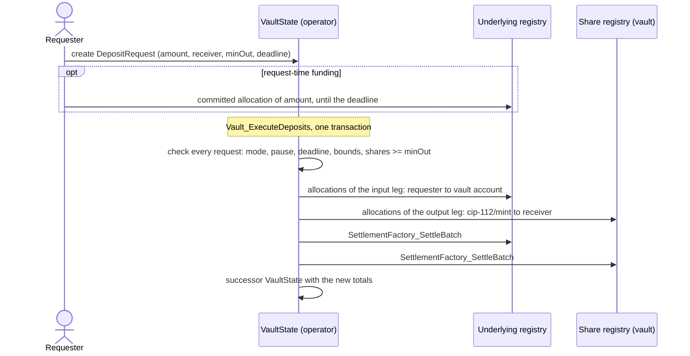

# Canton Vault

An ERC-4626-style share vault for Canton, written in Daml, over one Canton Token Standard V2 asset.

> [!IMPORTANT]
> **Status.** A proposed contribution for OpenZeppelin canton-contracts [issue #28](https://github.com/OpenZeppelin/canton-contracts/issues/28). The code has not been audited. It is not for production use.

## What it is

A vault holds one underlying instrument and issues shares against it, with ERC-4626 conversion and rounding: deposits mint shares rounded down, redemptions pay assets rounded down, and virtual shares and assets defend against inflation of the share price. Every deposit and redemption settles in one Daml transaction through the Canton Token Standard V2 allocation and settlement interfaces, so the underlying moves and the shares are minted or burned atomically, or nothing happens. The shares are themselves a Token Standard V2 token whose registry is part of the vault package, and the code follows the package layout and conventions of OpenZeppelin's [canton-contracts](https://github.com/OpenZeppelin/canton-contracts) library.

## Packages

| Package | Kind | Contents |
|---|---|---|
| [`cvx-vault-math-v1`](packages/utils/vault-math-v1/README.md) | Utility, no templates | `mulDiv` with floor and ceiling rounding over the full `Decimal` range, and the share conversion functions |
| [`cvx-api-vault-v1`](packages/token/api-vault-v1/README.md) | Frozen API | The `Vault` interface: a view for wallets and indexers, no choices |
| [`cvx-vault-v1`](packages/token/vault-v1/README.md) | Implementation | `VaultState`, `DepositRequest`, `RedeemRequest`, and the share registry |
| [`com-example-vault-admission-v1`](examples/vault-admission-v1/README.md) | Example, never released | A vault behind an on-ledger admission check |
| [`cvx-vault-reconcile-tool`](tools/vault-reconcile/README.md) | Tool, never released | A read-only Daml Script that reconciles a vault's totals with custody and share events |

Each package has a test package beside it under `test/`, `examples/` or `tools/`.

## Quick start

Install dpm and the SDKs as the [dpm documentation](https://docs.canton.network/sdks-tools/cli-tools/dpm) describes, with a JDK 17 or later:

```sh
curl https://get.digitalasset.com/install/install.sh | sh
dpm install 3.4.11
dpm install 3.5.10
```

Build every package with the workspace SDK, 3.4.11, and run the vault's tests with template and choice coverage:

```sh
dpm build --all
DAML_PACKAGE=test/vault-v1-test dpm test --all --show-coverage
DAML_PACKAGE=examples/vault-admission-v1-test dpm test --all
```

Run the example's whole flow on a local Canton sandbox (SDK 3.5.10, protocol version 35), printing each step; it needs `jq`, `unzip` and `lsof`, and free ports 6864 and 6866 to 6869:

```sh
scripts/demo.sh
```

[`CONTRIBUTING.md`](CONTRIBUTING.md) lists every gate and how to run it.

## How a deposit and a redemption work

A requester creates a `DepositRequest` naming the amount, the receiver of the shares, the minimum it accepts (`minOut`) and a deadline. It can fund the request at once with a committed allocation of the underlying, or leave the allocation to the execution. The operator, or in Permissionless mode the requester, then exercises `Vault_ExecuteDeposits` on the vault state with a batch of up to 25 requests. The vault checks every request first, computes the shares from the running totals, and settles each request with two legs: the underlying from the requester's account to the vault's account, and new shares from the share registry's `cip-112/mint` account to the receiver. A redemption is the mirror image: shares go to `cip-112/burn` and the underlying goes from the vault's account to the receiver. The full order of checks and effects is in [`docs/SPEC.md`](docs/SPEC.md), section 5.



## Trust model

The operator signs the vault state, owns the vault's account at the underlying registry, and is the instrument admin of the shares.
Through vault choices every amount is computed exactly, rounded in the vault's favour, and moved atomically with the accounting; a requester gets at least `minOut` or nothing moves.
Outside vault choices the operator can move custody, rewrite the vault state, mint shares, and settle a pending request's input alone; the library cannot prevent this and makes it detectable by reconciliation.
In Permissioned mode requests execute only when the operator acts; in Permissionless mode requesters execute their own, and the operator's participant must still confirm.
[`docs/SECURITY.md`](docs/SECURITY.md) states each threat, its mitigation and the test that shows it, and the open questions before production use.

## Verification

Two runs back the figures below. The fast gates were run on this repository as published: Q-12, Q-16, Q-02 and Q-11, then the build and every unit and scenario test on each SDK of the matrix. The longer suites come from the final full run of [`scripts/ci.sh`](scripts/ci.sh) at commit `feda338` of the development history, which is not part of this repository's history. Every figure can be reproduced with the linked script.

| Evidence | Result | Run | Reproduce |
|---|---|---|---|
| Unit and scenario tests, in memory | 267 Daml Script runs per SDK on SDK 3.4.11, 3.5.8 and 3.5.10, 0 failures: 239 vault, 20 math and 2 API tests, and the example's 5 tests and its demo; the tool's 5 tests pass on each SDK too | this repository | [`scripts/check-coverage.sh`](scripts/check-coverage.sh), [`scripts/check-tools.sh`](scripts/check-tools.sh) |
| Coverage | Every production template created and every choice exercised, the example's included; 13 of 13 interface choices of the vault package exercised | this repository | [`scripts/check-coverage.sh`](scripts/check-coverage.sh), [`scripts/check-interface-coverage.py`](scripts/check-interface-coverage.py) |
| Rename | The renamed tree builds on all three SDKs and passes every unit and scenario test on SDK 3.5.8; the renamed API package's ID is `1877add94dae2d94` | this repository | [`scripts/rename-d17.py`](scripts/rename-d17.py) |
| The same tests on Canton sandboxes | 259 tests per run, 0 failures, on protocol version 34 (SDK 3.4.11) and on protocol version 35 with the DARs of SDK 3.4.11 and of SDK 3.5.10 | `feda338` | [`scripts/check-sandbox.sh`](scripts/check-sandbox.sh) |
| Operation sequences | 1,000 seeded sequences per SDK (3.4.11 and 3.5.10), 30,112 operations, invariants checked after each, 0 violations | `feda338` | [`scripts/check-sequences.sh`](scripts/check-sequences.sh) |
| Differential math | 211 edge vectors and 20,000 seeded random vectors against an exact Python oracle, 0 mismatches, on SDK 3.4.11 and 3.5.10 | `feda338` | [`scripts/check-math-oracle.sh`](scripts/check-math-oracle.sh) |
| Proofs | 41 of 41 Z3 obligations on the integer model of the math | `feda338` | [`scripts/check-math-proofs.sh`](scripts/check-math-proofs.sh) |
| Upgrade | Compatible patches accepted by `dpm upgrade-check`; an API patch and a breaking change refused | `feda338` | [`scripts/check-upgrade.sh`](scripts/check-upgrade.sh) |
| Mutation | 331 of 331 vault, share registry and conversion mutants killed, 4 recorded as equivalent with their arguments; 47 of 47 math mutants killed | full mutation runs on SDK 3.4.11 before `feda338`; `feda338` checked that every mutant still applies | [`scripts/mutate-registry.py`](scripts/mutate-registry.py), [`scripts/mutate-math.py`](scripts/mutate-math.py) |

Since `feda338` the production packages have changed in one comment line. The later commits moved test and example directories to the library's layout, renamed the example, and added tests, documents and checks; none changed what a choice does.

## Compatibility

| | |
|---|---|
| Daml SDKs run | 3.4.11, 3.5.8 and 3.5.10 for the build and the in-memory tests; 3.4.11 and 3.5.10 for the sandboxes, the demo and the upgrade check |
| Daml-LF | 2.1 |
| Canton protocol versions | 34 (Canton 3.4.11) and 35 (Canton 3.5.17), on local sandboxes |
| Token Standard | V2 API DARs from Splice tag [0.8.4](https://github.com/canton-network/splice/tree/0.8.4/daml/dars), pinned by package ID in [`dars/manifest.yaml`](dars/manifest.yaml) and checked by [`scripts/check-token-dars.sh`](scripts/check-token-dars.sh) |

The API package is always built by SDK 3.4.11, and the other packages consume that DAR on every SDK; its package ID is recorded in [`dars/api-packages.yaml`](dars/api-packages.yaml).

## Renaming to the library's names

The packages use the working names `cvx-*` and the modules `Cayvox.*`, so that the code does not present itself as OpenZeppelin's before the maintainers accept it. [`scripts/rename-d17.py`](scripts/rename-d17.py) copies the repository and renames packages to `openzeppelin-*`, modules to `OpenZeppelin.*` and error identifiers to `openzeppelin.com/<component>-<failure>`, and records the renamed API package's new ID. [`scripts/check-rename.sh`](scripts/check-rename.sh) builds the renamed copy and runs its tests on every SDK of the matrix. The example keeps its `com-example-*` name and `Example.*` modules, as the library's examples do.

```sh
scripts/rename-d17.py ../canton-vault-renamed
```

## License and acknowledgements

MIT, see [`LICENSE`](LICENSE). Four check scripts are ported from OpenZeppelin [canton-contracts](https://github.com/OpenZeppelin/canton-contracts) (MIT, [`LICENSES/canton-contracts-MIT.txt`](LICENSES/canton-contracts-MIT.txt)), and the vendored Token Standard DARs are from [Splice](https://github.com/canton-network/splice) (Apache 2.0, [`LICENSES/splice-Apache-2.0.txt`](LICENSES/splice-Apache-2.0.txt)). The rounding follows OpenZeppelin's ERC-4626 implementations for Solidity, Cairo and Stellar.

## About

Built by [Cayvox Labs](https://cayvox.com).
